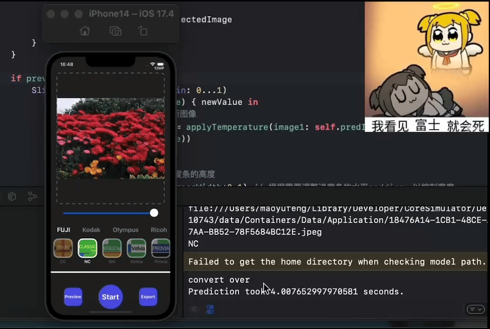

<h1>AI Film Simulation</h1>

  <h6>
    Auther：Slash	eMail：1364435561@qq.com
  </h6>

#### 1.Introduction

Use `neural networks` to fit various `camera filters` and `film colors`! The follow-up will `always update iteration` down, welcome to pay attention, welcome to the top right corner click `Started` ☆! This will be a great help, thank you! Geting for free is also welcome!

#### 2.Catalogue

- `【dir】static`：weight files and GUI resource files
  - `checkpoints`：weight files
  - `src`：resource files
- `【dir】idea`：theoretical research
  - `src`：resource files
- `【dir】pack`：Nuitka package
- `【dir】script`：model convert script
- `train.py`：training script
- `train_new.py`：new training script
- `dataset.py`：dataset script
- `gui.py`：pyqt script
- `infer.py`：inference script
- `loss.py`：loss function
- `models.py`：models
- `preprocessing.py`：data preprocessing
- `utils`：utils

#### 3.Checkpoints

###### Negative color mask

* [x] `NegativeLabPro（NLP`）：**static/checkpoints/film-mask** 

###### Olympus Film
* [x] `VIVID-浓郁色彩` ：**static/checkpoints/olympus/vivid** 

* [ ] `SoftFocus-柔焦` ：

* [ ] `SoftLight-柔光` ：

* [ ] `Nostalgia-怀旧颗粒` ：

* [ ] `Stereoscopic-立体` ：

###### Fuji Film
* [x] `ACROS `：**static/checkpoints/fuji/acros**

* [x] `CLASSIC CHROME` ：**static/checkpoints/fuji/classic-chrome**

* [x] `ETERNA `：**static/checkpoints/fuji/enerna** 

* [x] `ETERNA BLEACH BYPASS `：**static/checkpoints/fuji/eb** 

* [x] `CLASSIC Neg. `：**static/checkpoints/fuji/classic-neg**

* [x] `PRO Neg.Hi `：**static/checkpoints/fuji/negstdhi** 

* [x] `NOSTALGIC Neg.`：**static/checkpoints/fuji/nostalgic-neg** 

* [x] `PRO Neg.Std` ：**static/checkpoints/fuji/negstd** 

* [x] `ASTIA `：**static/checkpoints/fuji/astia** 

* [x] `PROVIA`：**static/checkpoints/fuji/provia** 

* [x] `VELVIA`：**static/checkpoints/fuji/velvia** 

* [x] `Pro 400H`：**static/checkpoints/fuji/pro400h** 

* [x] `Superia 400`：**static/checkpoints/fuji/superia400**

###### Kodak Film
* [x] `Color Plus`：**static/checkpoints/kodak/colorplus** 

* [x] `Gold 200`：**static/checkpoints/kodak/gold200** 

* [x] `Portra 400`：**static/checkpoints/kodak/portra400** 

* [x] `Portra 160NC`：**static/checkpoints/kodak/portra160nc** 

* [x] `UltraMax 400`：**static/checkpoints/kodak/ultramax400** 

###### Rochi Film
* [ ] `Std-标准` ：

* [ ] `Vivid-鲜艳` ：

* [ ] `Single-单色` ：

* [ ] `SoftSingle-软单色` ：

* [ ] `StiffSingle-硬单色` ：

* [ ] `ContrastSingle-高对比对黑白` ：

* [ ] `Neg-负片` ：

* [ ] `R-Pos-正片` ：

* [ ] `R-Nostalgia-怀旧` ：

* [ ] `R-HDR-HDR` ：

* [ ] `R-Pos2Neg-正负逆冲` ：

###### Polaroid Film

* [x] `Polaroid`：**static/checkpoints/polaroid** 

###### Sony Film

###### Nikon Film

###### Canon Film

###### Hasselblad Film

<h6>Model-Checkpoint</h6>

| Model            | Checkpoint   |
| ---------------- | ------------ |
| FilterSimulation | filmcnn.pth  |
| UNet             | unet.pth     |
| UCM              | best-ucm.pth |

**Notice: use unet model can get more details**

#### 4.Usage

###### Pycharm

1. Configuration environment：`pip install -r requirements.txt`.
2. Run `python gui.py` by GUI interface or run `python infer.py` by script inference.

###### Windows GUI

1. `Windows` Link

- 【V1.0】链接: https://pan.baidu.com/s/1WsBZbzCftyTMy3ZmzhJlDA 提取码: fmnq
- 【V1.1】链接: https://pan.baidu.com/s/1icLOXtVjUYqTkeDqf-o8Ag 提取码:e939

2. Run the `AIFilter.exe` executable in AIFilter.dist.

###### MacOS GUI

1. ` Silicon` Link (M1/M2/m3)`

- 【V1.0】链接: https://pan.baidu.com/s/1N5ux3eSUgYQTSB30iFw1GQ 提取码: nck8 
- 【V1.1】链接: https://pan.baidu.com/s/1rnI5xPbwTkuZmetiWv0_6A 提取码: trbp 
- 【V1.2】链接: https://pan.baidu.com/s/15v0pnFeGRMfCcVX5FE53_A 提取码: vp2x

2. `Intel` Link (i5/i7/i9)

- 【V1.0】链接: https://pan.baidu.com/s/14afbEXX_C4F7b-OeFHXRQg 提取码: mjc7 
- 【V1.1】链接: https://pan.baidu.com/s/1SmBLFE7MT4KwxzbSzpJGYA 提取码: nbue 

3. run `AIFilter.app` or move to `application`.

###### GUI(New design)

###### iPhone inference

convert pytorch to coreml，and infer on iphone14 pro, cost 4s when inferring a 12M image.

#### 5.Experimental Record

1.Refer to `idea/对比实验.md`, the framework is as follows:

2.Refer to `idea/自适应图像色彩迁移方案.md`, the framework is as follows:

#### 6.TODO

* [ ] Collect relevant image data to train more types of film simulations

* [x] Try to unify the mapping from all devices (iphone/ Android/Canon/Nikon, etc.) to film simulation

* [x] Porting to iPhone Inference
* [x] Supports onnx inference
* [x] Supports coreml inference
* [x] Supports TensorFlow inference
* [x] Supports  mlx inference

#### 7.Update

1. 【24.01.21|Beta1.0】

- `Velvia`、`nn`、`nlp` 6 film filters.
- `GUI`

2. 【24.02.05|Beta1.1】

- Add 2 film filters : `nc`、`cc` .
- Add saving path prompt pop-up.
- Fix png image loading error, image format is opencv supported image type.
- Fix image loading display issue, retain original image scale for adaptive fill.

3. 【24.06.14】

- A new unified color simulation scheme is studied, which includes two stages of Decoloring and Coloring. For details, refer to `idea/自适应图像色彩迁移方案.md` .

4. 【24.07.4】

- Added provia filter, support for click/drag upload image, support for model switching.

5. 【24.09.20】

- Offer onnx、TensorFlow、mlx、coreml model converting script.

- Offer neural preset training script

6. 【25.01.31】
- Redesign the interface

- New Brand selection button

- Complete all film model training at Fuji

- Support raw formate：HEIF、RAF、CR2、CR3、RW2、DNG、PEF、ARW