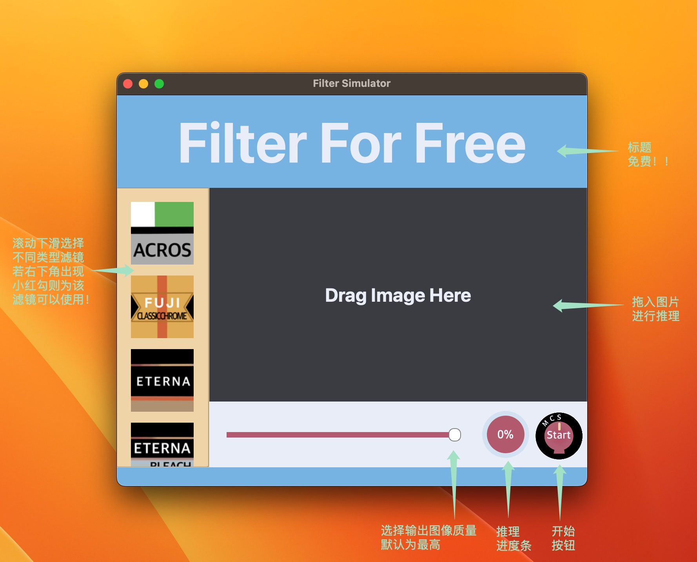

## FilterSimulation

#### 1.介绍
使用`神经网络`拟合各种`相机滤镜`、`胶片色彩`！后续会`一直更新迭代`下去，欢迎关注，欢迎右上角点一下`Started`☆！这会有很大的帮助，谢谢！也欢迎白嫖！

#### 2.目录
- `images`：用于测试的图片路径（不重要
- `test`：记录图片训练过程变化-gif（不重要
- `static`：权重文件和GUI资源文件
- `pack`：Nuitka打包文件
- `train.py`：训练脚本
- `dataset.py`：数据构造
- `gui.py`：pyqt界面
- `infer.py`：推理脚本
- `loss.py`：损失函数
- `models.py`：模型
- `preprocessing.py`：数据预处理
- `utils`：功能函数

#### 3.模型权重
###### 负片去色罩
1. `NegativeLabPro（NLP`）：**static/checkpoints/film-mask/best.pth** ✅️

###### 奥林巴斯色彩模拟
1. `VIVID-浓郁色彩` ：**static/checkpoints/olympus/vivid/best.pth** ✅
2. `SoftFocus-柔焦` ：❎
3. ️`SoftLight-柔光` ：❎
4. `Nostalgia-怀旧颗粒` ：❎
5. `Stereoscopic-立体` ：❎

###### 富士色彩模拟
1. `ACROS `：❎
2. `CLASSIC CHROME` ：❎
3. `ETERNA `：❎
4. `ETERNA BLEACH BYPASS `：❎
5. `CLASSIC Neg. `：❎
6. `PRO Neg.Hi `：❎
7. `NOSTALGIC Neg.`：**static/checkpoints/fuji/nostalgic-neg/best.pth** ✅
8. `PRO Neg.Std` ：❎
9. `ASTIA `：❎
10. `PROVIA`：❎
11. `VELVIA`：**static/checkpoints/fuji/velvia/best.pth** ✅
12. `Pro 400H`：**static/checkpoints/fuji/pro400h/best.pth** ✅
13. `Superia 400`：**static/checkpoints/fuji/superia400/best.pth** ✅

###### 柯达色彩模拟
1. `Color Plus`：**static/checkpoints/kodak/colorplus/best.pth** ✅
2. `Gold 200`：**static/checkpoints/kodak/gold200/best.pth** ✅
3. `Portra 400`：**static/checkpoints/kodak/portra400/best.pth** ✅
4. `Portra 160NC`：**static/checkpoints/kodak/portra160nc/best.pth** ✅ 
5. `UltraMax 400`：**static/checkpoints/kodak/ultramax400/best.pth** ✅

###### 理光色彩模拟
1. `Std-标准` ：❎
2. `Vivid-鲜艳` ：❎
3. `Single-单色` ：❎
4. `SoftSingle-软单色` ：❎
5. `StiffSingle-硬单色` ：❎
6. `ContrastSingle-高对比对黑白` ：❎
7. `Neg-负片` ：❎
8. `R-Pos-正片` ：❎
9. `R-Nostalgia-怀旧` ：❎
10. `R-HDR-HDR` ：❎
11. `R-Pos2Neg-正负逆冲` ：❎

###### 索尼色彩模拟

###### 尼康色彩模拟

###### 佳能色彩模拟

###### 哈苏色彩模拟

#### 4.使用方法
###### Pycharm等解释器（适用于所有平台）

1. 配置环境：`pip install -r requirements.txt`
2. `python gui.py` 使用GUI界面运行 或者 `ython infer.py` 使用脚本推理

###### Windows GUI

1. `Windows`链接: https://pan.baidu.com/s/1STMCrbVgPygCdWKEn_Mtmg 提取码: a3ue
2. 运行AIFilter.dist中的**AIFilter.exe**可执行文件

###### MacOS GUI

1. `Apple Silicon`链接(M1/M2/m3): https://pan.baidu.com/s/16J-KLy-8VjAhCjbnURC10A 提取码: maim 
2. `Intel`链接(i5/i7/i9): https://pan.baidu.com/s/1MFww31KUhf6mG8QQBs_zhQ 提取码: enpi 
3. 运行`AIFilter.app` 或者拖到`应用程序`中

###### GUI介绍

#### 实验记录

参考`对比实验.pdf`

#### 用户问题记录★★★★★

- MacOS M系列出现`已损坏，无法打开`提示
  1. 打开电脑`终端`，输入`sudo spctl --master-disable`和`密码`，回到`【系统偏好设置】`▸`【安全性与隐私】`▸``【安全性】/【通用】`，选中`任何来源`选项。
  2. 打开 “终端的完全磁盘访问” 权限。`【系统设置】` ▸ `【隐私与安全性】` ▸ `【完整磁盘访问权限】` 勾选了`【终端】` (如果之前勾选过-然后+）
  3. 打开`【系统设置】`▸`【隐私与安全性】`▸`【安全性】`板块下，不明身份的开发者 点下方的`【仍要打开】`

-  程序闪退
  1. 可以在terminal中使用`open AIFilter.app` 命令打开或`右键显示包内容`▸`Contents`▸`MacOS`▸`AIFilter`▸`右键在终端中打开`

#### TODO

1.收集相关图像数据训练更多类型胶片模拟

2.尝试统一所有设备（iphone/安卓/佳能/尼康等相机）到胶片模拟的映射
