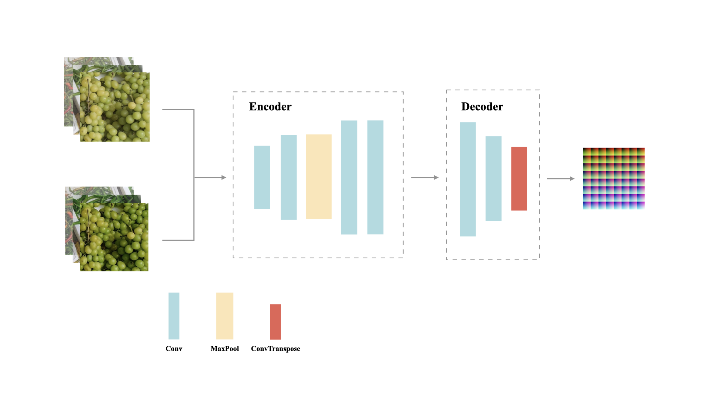
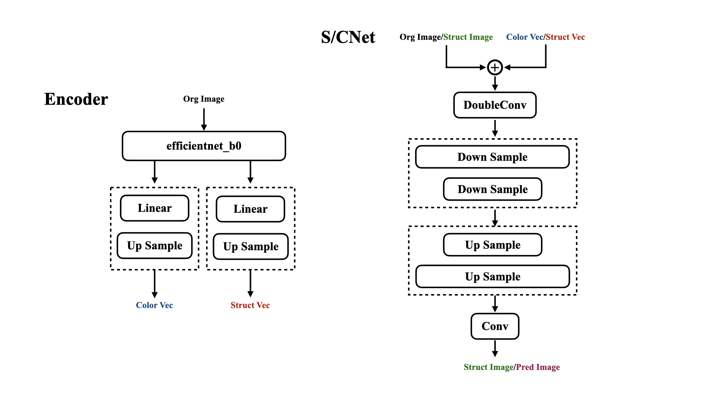

<h1>AI胶片模拟</h1>

  <h6>
    作者：Slash	邮箱：1364435561@qq.com
  </h6>

#### 1.介绍

使用`神经网络`拟合各种`相机滤镜`、`胶片色彩`！后续会`一直更新迭代`下去，欢迎关注，欢迎右上角点一下`Started`☆！这会有很大的帮助，谢谢！也欢迎白嫖！

#### 2.目录
- `【dir】static`：权重文件和GUI资源文件
  - `checkpoints`：权重文件
  - `src`：资源文件
- `【dir】idea`：理论研究
  - `src`：资源文件
- `【dir】pack`：Nuitka打包文件
- `【dir】script`：模型转换推理脚本
- `train.py`：训练脚本
- `train_new.py`：新的训练脚本
- `dataset.py`：数据构造
- `gui.py`：pyqt界面
- `infer.py`：推理脚本
- `loss.py`：损失函数
- `models.py`：模型
- `preprocessing.py`：数据预处理
- `utils`：功能函数

#### 3.模型权重
###### 负片去色罩
* [ ] `NegativeLabPro（NLP`）：**static/checkpoints/film-mask** 

###### 奥林巴斯色彩模拟
* [x] `VIVID-浓郁色彩` ：**static/checkpoints/olympus/vivid** 

* [ ] `SoftFocus-柔焦` ：

* [ ] `SoftLight-柔光` ：

* [ ] `Nostalgia-怀旧颗粒` ：

* [ ] `Stereoscopic-立体` ：

###### 富士色彩模拟
* [x] `ACROS `：**static/checkpoints/fuji/acros**

* [x] `CLASSIC CHROME` ：**static/checkpoints/fuji/classic-chrome**

* [x] `ETERNA `：**static/checkpoints/fuji/enerna** 

* [x] `ETERNA BLEACH BYPASS `：**static/checkpoints/fuji/eb** 

* [x] `CLASSIC Neg. `：**static/checkpoints/fuji/classic-neg**

* [x] `PRO Neg.Hi `：**static/checkpoints/fuji/negstdhi** 

* [x] `NOSTALGIC Neg.`：**static/checkpoints/fuji/nostalgic-neg** 

* [x] `PRO Neg.Std` ：**static/checkpoints/fuji/negstd** 

* [x] `ASTIA `：**static/checkpoints/fuji/astia** 

* [x] `PROVIA`：**static/checkpoints/fuji/provia** 

* [x] `VELVIA`：**static/checkpoints/fuji/velvia** 

* [x] `Pro 400H`：**static/checkpoints/fuji/pro400h** 

* [x] `Superia 400`：**static/checkpoints/fuji/superia400** 

* [x] `reala`：**static/checkpoints/fuji/rela**

###### 柯达色彩模拟
* [x] `Color Plus`：**static/checkpoints/kodak/colorplus** 

* [x] `Gold 200`：**static/checkpoints/kodak/gold200** 

* [x] `Portra 400`：**static/checkpoints/kodak/portra400** 

* [x] `Portra 160NC`：**static/checkpoints/kodak/portra160nc** 

* [x] `UltraMax 400`：**static/checkpoints/kodak/ultramax400** 

###### 理光色彩模拟
* [ ] `Std-标准` ：

* [ ] `Vivid-鲜艳` ：

* [ ] `Single-单色` ：

* [ ] `SoftSingle-软单色` ：

* [ ] `StiffSingle-硬单色` ：

* [ ] `ContrastSingle-高对比对黑白` ：

* [ ] `Neg-负片` ：

* [ ] `R-Pos-正片` ：

* [ ] `R-Nostalgia-怀旧` ：

* [ ] `R-HDR-HDR` ：

* [ ] `R-Pos2Neg-正负逆冲` ：

###### 宝丽来色彩模拟
* [x] `Polaroid`：**static/checkpoints/polaroid** 

###### 索尼色彩模拟

###### 尼康色彩模拟

###### 佳能色彩模拟

###### 哈苏色彩模拟

<h6>模型对应权重文件</h6>

| Model            | Checkpoint   |
| ---------------- | ------------ |
| FilterSimulation | filmcnn.pth  |
| UNet             | unet.pth     |
| UCM              | best-ucm.pth |

**注：“使用unet模型获取更好的细节表现”**

#### 4.使用方法

###### Pycharm等解释器（适用于所有平台）

1. 配置环境：`pip install -r requirements.txt`
2. `python gui.py` 使用GUI界面运行或者运行`python infer.py` 使用脚本推理

###### Windows GUI

1. `Windows`链接
- 【V1.0】链接: https://pan.baidu.com/s/1WsBZbzCftyTMy3ZmzhJlDA 提取码: fmnq
- 【V1.1】链接: https://pan.baidu.com/s/1icLOXtVjUYqTkeDqf-o8Ag 提取码:e939
2. 运行AIFilter.dist中的**AIFilter.exe**可执行文件

###### MacOS GUI

1. `Apple Silicon`链接(M1/M2/m3)
- 【V1.0】链接: https://pan.baidu.com/s/1N5ux3eSUgYQTSB30iFw1GQ 提取码: nck8 
- 【V1.1】链接: https://pan.baidu.com/s/1rnI5xPbwTkuZmetiWv0_6A 提取码: trbp 
- 【V1.2】链接: https://pan.baidu.com/s/15v0pnFeGRMfCcVX5FE53_A 提取码: vp2x
- 【V1.3】链接: https://pan.baidu.com/s/1vFGzjBg0gy1eH3A1u6bC1w 提取码: qse4 
2. `Intel`链接(i5/i7/i9)
- 【V1.0】链接: https://pan.baidu.com/s/14afbEXX_C4F7b-OeFHXRQg 提取码: mjc7 
- 【V1.1】链接: https://pan.baidu.com/s/1SmBLFE7MT4KwxzbSzpJGYA 提取码: nbue 
3. 运行`AIFilter.app` 或者拖到`应用程序`中

###### GUI介绍（全新设计）

顶部为标题为Film Simulate，上方新增不同品牌的切换，每个品牌对应不同的滤镜选择，左侧为滤镜选择区域，未选中的滤镜呈灰色状态，选中的滤镜呈彩色状态；底部提供了模型选择按钮，用户可通过切换不同的模型来推理图像。

###### iPhone推理

实现了将pytorch模型转换为coreml，在xcode上实现iPhone离线推理，12MP的图像推理时间为4s左右。但是目前没有开发app的想法（主要是不会，若有会ios开发的请联系我）

#### 5.实验记录

1.参考`idea/对比实验.md`，框架如下：

2.参考`idea/自适应图像色彩迁移方案.md`，框架如下：

#### 6.未来计划

* [ ] 1.收集相关图像数据训练更多类型胶片模拟 

* [x] 2.尝试统一所有设备（iphone/安卓/佳能/尼康等相机）到胶片模拟的映射 

* [x] 3.移植到iPhone推理
* [x] 支持onnx推理
* [x] 支持coreml推理
* [x] 支持TensorFlow推理
* [x] 支持mlx训练推理

#### 7.更新日志

1. 【24.01.21|Beta1.0】

- `Velvia`、`nn`、`nlp`等胶片滤镜6个
- `GUI`界面

2. 【24.02.05|Beta1.1】

- 新增富士`nc`、`cc`两个胶片模拟
- 新增`保存路径提示弹窗`
- 修复png图像加载出错问题，图像格式为`opencv`所支持的图像类型
- 修复图像加载显示问题，保留`原始图像比例`进行`自适应填充`

3. 【24.06.14】

- 新研究了一种统一的色彩模拟方案，包括`去色`和`上色`两个阶段，详情参考`idea/自适应图像色彩迁移方案.md`

4. 【24.07.4】

- 新增provia滤镜，支持点击/拖拽上传图像，支持模型切换

5. 【24.09.20】

- 提供onnx、TensorFlow、mlx、coreml等模型的转换脚本

- 提供neural preset训练脚本

6. 【25.01.31】
- 重新设计界面

- 新增品牌选择按钮

- 完成富士所有滤镜模型训练

- 新增RAW格式支持：HEIF、RAF、CR2、CR3、RW2、DNG、PEF、ARW

  

#### 8.用户提问

- MacOS M系列出现`已损坏，无法打开`提示
  1. 打开电脑`终端`，输入`sudo spctl --master-disable`和`密码`，回到`【系统偏好设置】`▸`【安全性与隐私】`▸`【安全性】/【通用`，选中`任何来源`选项。
  2. 打开 “终端的完全磁盘访问” 权限。`【系统设置】` ▸ `【隐私与安全性】` ▸ `【完整磁盘访问权限】` 勾选了`【终端】` （如果之前勾选过-然后+）
  3. 打开`【系统设置】`▸`【隐私与安全性】`▸`【安全性】`板块下，不明身份的开发者 点下方的`【仍要打开】`
  4. 先把app放到`【应用程序】`再在`【终端】`执行`sudo xattr -rd com.apple.quarantine 你的app路径`，例如：`sudo xattr -rd com.apple.quarantine /Applications/FilterSimulation.app`
-  MacOS M系列出现`闪退`
  
  1. 可以在terminal中使用`open AIFilter.app` 命令打开或`右键显示包内容`▸`Contents`▸`MacOS`▸`AIFilter`▸`右键在终端中打开`
  2. 安装`command-line-tools`：在`【终端】`中运行`xcode-select --install`命令进行安装，安装完成后输入`sudo codesign --fo：rce --deep --sign - 你的app路径` ，例如：`sudo codesign --force --deep --sign -  /Applications/FilterSimulation.app`
-  其他相机/手机使用后是否存在偏差
- 关于运行源码问题
  1. M系列芯片在运行`gui.py`时候，可能出现`PyQt5`的安装问题，由于目前`该库不支持使用pip安装`，需要使用`berw`安装，再将这个库拖入到自己的`site_packages`中。自行百度解决or参照：https://blog.csdn.net/WHUGIS1805/article/details/129702200
