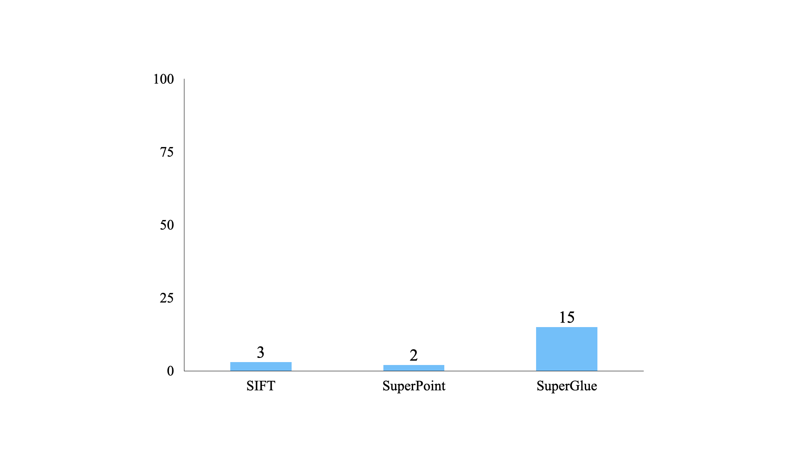
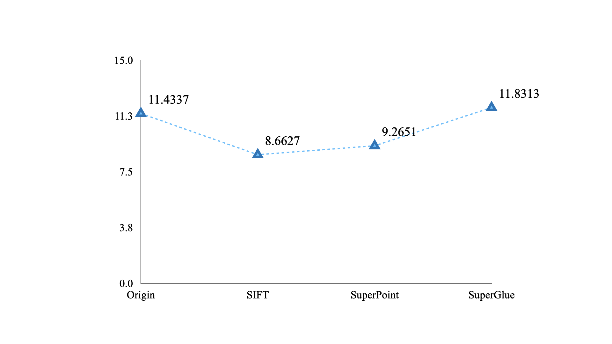
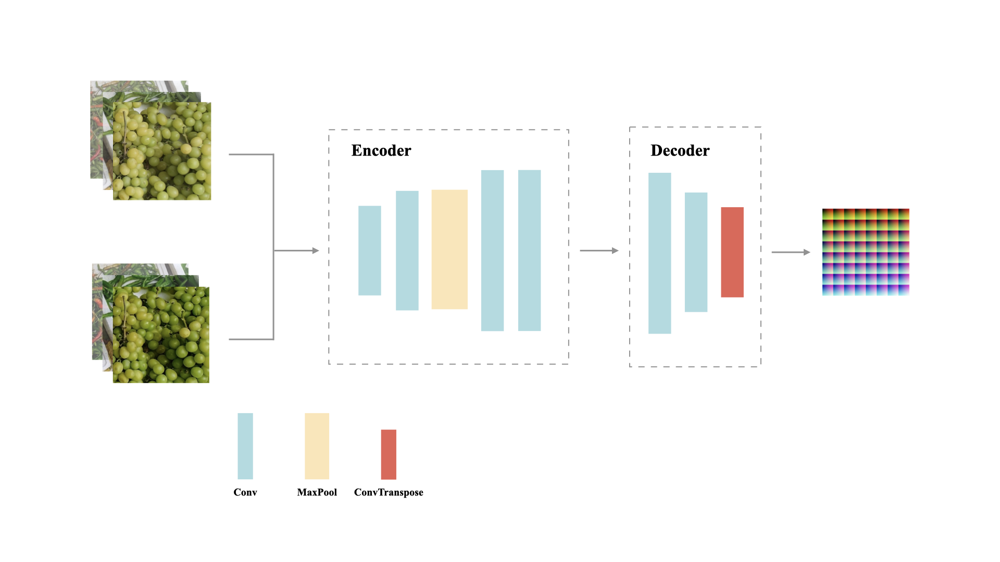
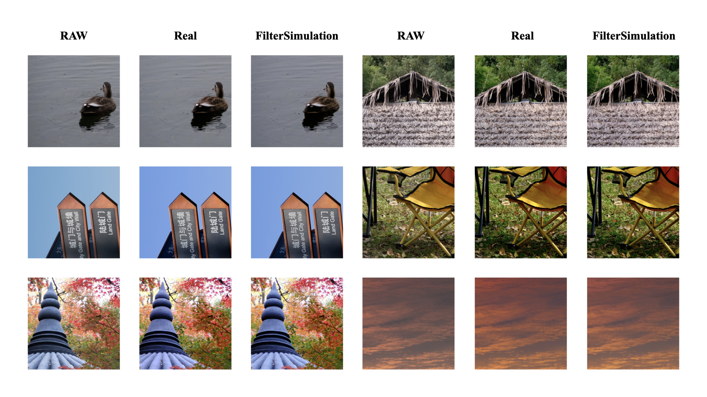
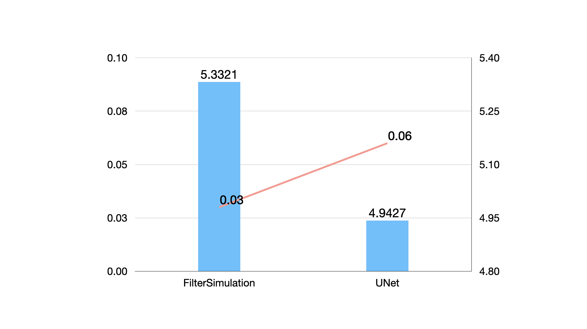

<h2>一个简单、通用的少样本胶片模拟模型</h2>

<h6>Auther：Slash</h6>

<h6>URL：https://gitee.com/fg_slash/filter4free</h6>

#### 关于前言

硬核破解富士胶片模拟滤镜！

#### 关于数据

本次实验数据来自富士xs-20相机中的Velvia胶片模拟，总计拍摄了200+对图像，每对图像包括RAW和JPG格式，图像拍摄的参数也不尽相同。

#### 关于预处理

考虑到原始数据的数量较少以及高分辨率图像在神经网络训练的超高成本，图像增广是必然的。将每一组高分辨图像进行700×700的切块操作，同时进行图像配准，裁切周边30像素，获得640×640像素的图像，这样一组图像被认为是一组适合用于训练的输入图像组。为了继续扩充图像，将从这些对齐后的图像组中随机二次裁剪、拼接成一组新的图像，尝试让模型更加关注色彩信息，忽略结构信息。

图像配准工作可以有效的减小图像像素偏移带来的损失，进一步提高模型的收敛速度和鲁棒性。在特征提取方面我对比了传统的SIFT算法和基于CNN的特征提取；在关键点匹配方面也采取了KNN和GNN匹配方式。我在100对图像上进行了实验，其中SIFT和SuperPoint在图像配准过程中失败率较低，而使用SuperGlue后存在相对较多的失败情况。

图1&nbsp;&nbsp;&nbsp;100次图像配准中的丢失数 

去除无法配准的图像同时计算平均配准的损失（83对），可以看到最简单的SIFT提取的特征点进行配准的效果竟然是最好的。其中Origin：不经过任何配准；SIFT：SIFT+KNN；SuperPoint：CNN+KNN；SuperGlue：CNN+GNN；最后统一计算透视变换矩阵，最后使用RANSAC算法估计单应性矩阵进行配准。配准的损失由L1Loss作为评估指标。

图2&nbsp;&nbsp;&nbsp;图像配准损失 

#### 关于模型

色彩模拟任务的本质是学习一组图像之间的色彩映射，所以理论上如果所有的输出图像都是由同一个变换后的输入图像变化而来，那么一定可以通过神经网络反推出这组变换参数，且这应该是一个非常简单的任务。我设计了一个编码器-解码器结构的简单网络，编码器由4个卷积层和1个池化层组成，用来提取图像的浅层特征；解码器由2个卷积层1个反卷积层组成，用来上采样到原始图像大小。同时在模型中引入了温度系数来控制色彩变化强度。

图3&nbsp;&nbsp;&nbsp;FilterSimulation 

对于损失函数，我尝试了ChiSquareLoss、HistogramLoss、EMDLoss分别和L1Loss的组合，但在训练过程中都存在验证损失曲线震荡的情况。考虑到图像的色彩的呈现依托于RGB通道，所以我决定对图像的任意两通道的差异进行计算，同时再对每一组图像的通道差异求绝对误差，用来学习图像的色彩信息，同时加上L1Loss来学习图像的结构信息，有效的避免了过拟合的情况发生。
$$
\begin{aligned}
& C_{RG}=(C_R-C_G)^2,C_{GB}(C_G-C_B)^2,C_{BR}(C_B-C_R)^2\\
& CLoss=\sqrt{C_{RG}^2+C_{GB}^2+C_{BR}^2}\\
& RGBLoss=\sum_{i=1}^{n}\left|CLoss_{x_i}-ClLoss_{y_i}\right|\\
\end{aligned}
$$

$$
\begin{aligned}
& L1Loss=\sum_{i=1}^{n}\left|y_{i}-f\left(x_{i}\right)\right|
\end{aligned}
$$

$$
TotalLoss=L1Loss+RGBLoss
$$

#### 关于效果

图4&nbsp;&nbsp;&nbsp;效果对比 

为了探究模型的网络结构对实际效果的影响，我采用一个小型的Unet结构的网络重新进行训练，并且使用两个模型对验证集数据进行了测试（520对），并采用L1Loss作为最终的比较依据，同时我也测试了两者在推理速度上的差异。

图5&nbsp;&nbsp;&nbsp;FilterSimulation&nbsp;vs&nbsp;UNet 

不难看出增大网络的复杂程度的确可以提升模型的效果，但其实从肉眼的角度出发，我们已经几乎无法判别两者在色彩上的差异，且小模型的推理速度可以提升近一倍的效果，这种情况在高分辨率图像上尤为明显！
