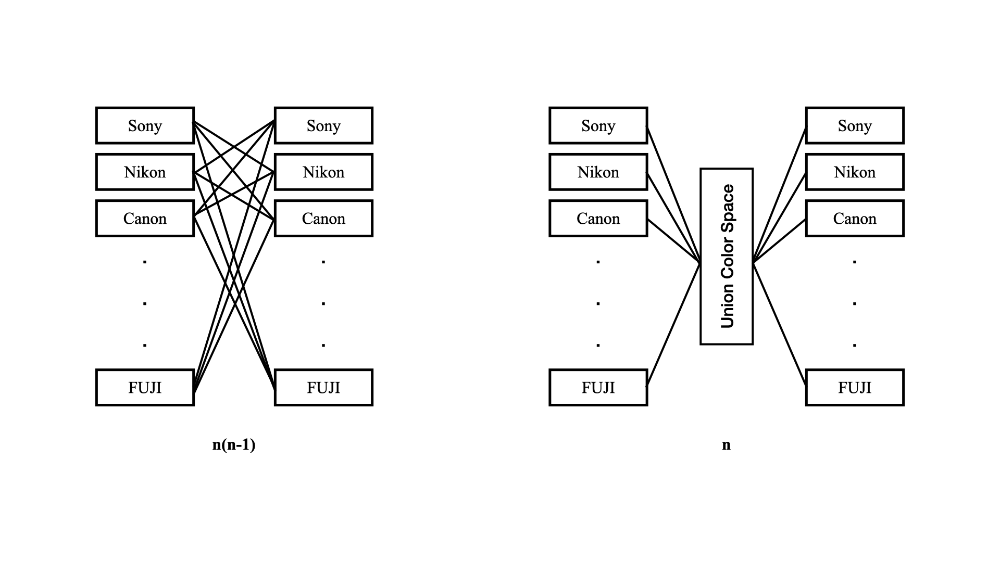
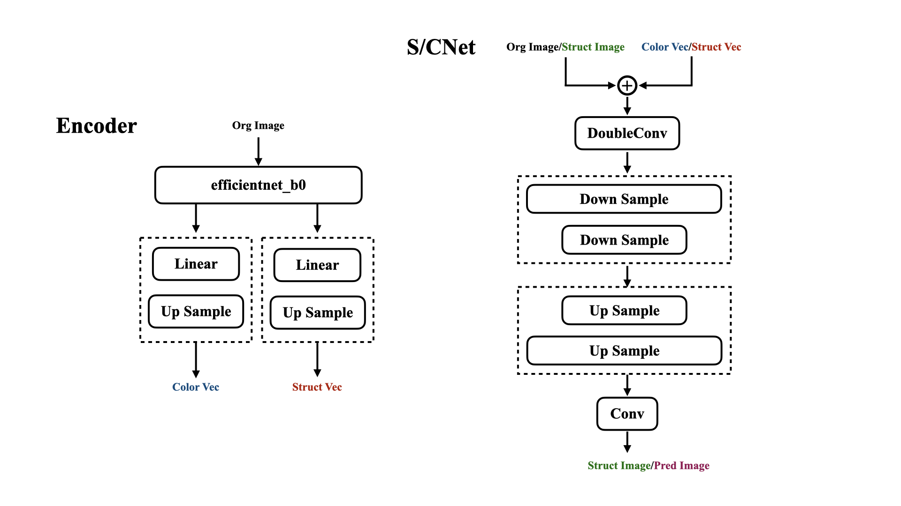
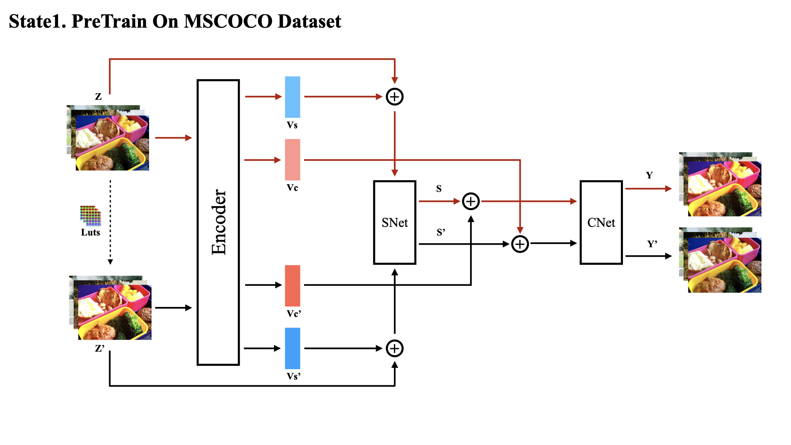
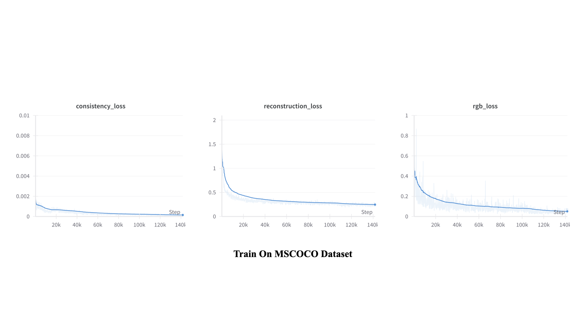
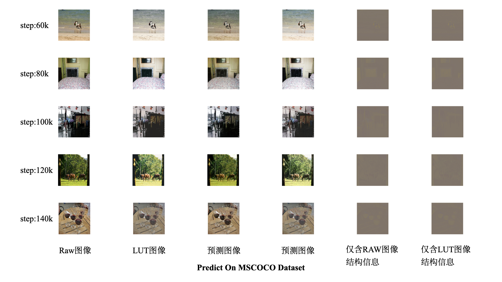
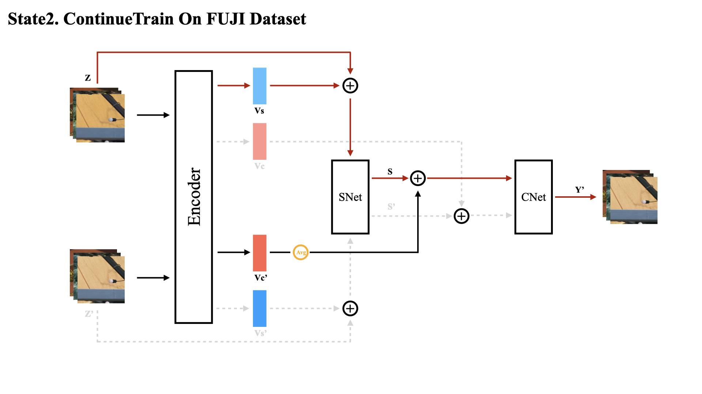
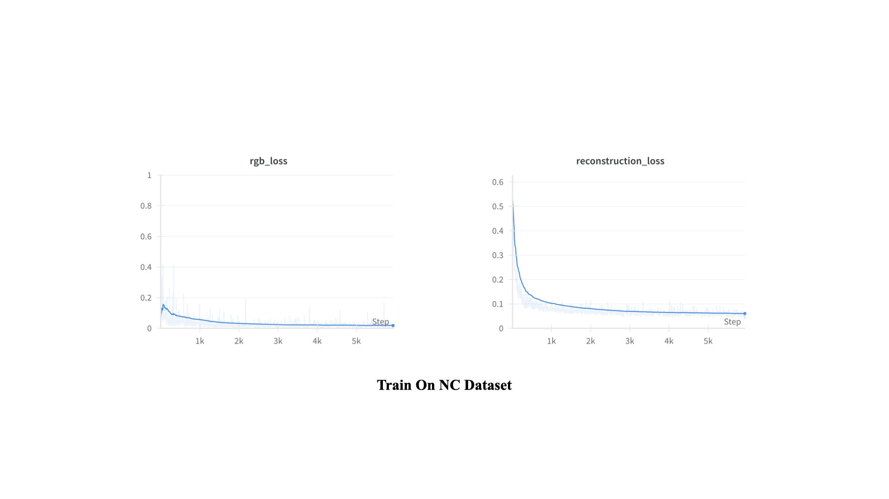
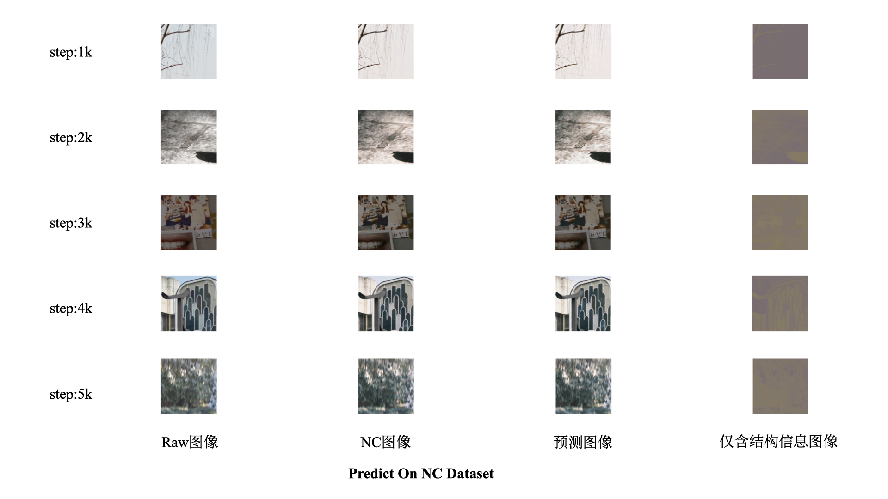
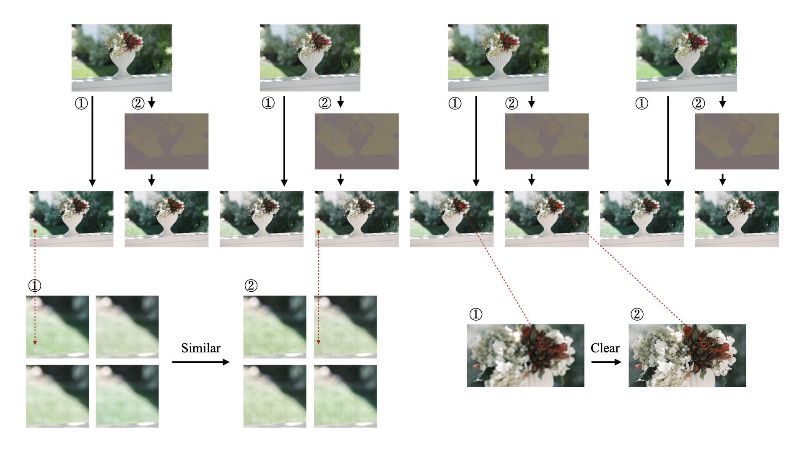

<h2>一种统一的色彩模拟方案</h2>

<h6>Auther：Slash</h6>

#### 概述

本项目的主要的思想参考自论文**《Neural Preset for Color Style Transfer》**，先主要说一下这篇论文的一些工作，主要就是提出了一种新的色彩迁移的方式，将图像的色彩信息和内容结构信息进行**分离再上色**的操作，且上色操作是基于**矩阵乘法**运算的，是线性的，因此在高分辨率图像上可以实现**高效**的计算。

为了解决不同设备产生的微小色彩偏移，采用传统的色彩映射虽然可以实现，但需要为每一种设备都训练与之对应的色彩权重，几乎是$n^2$量级的工作量，同时**数据的采集也是极为困难**的。于是思考是否可以将不同色彩全部先**映射到统一的色彩空间**当中，再从该**统一的色彩空间映射到所需的目标色彩空间**，这样的话工作量就降至$n$量级了。

#### 模型

Encoder网络采用预训练的**efficientnet_b0**模型作为骨干网络来提取特征，再此基础新增两个上采样器，由一个Linear层和Upsample层组成，为了迎合训练的图像的大小，所以这里选择上采样到256。特征融合模块采用了裁剪版的**Unet**模型，裁剪掉了256维度及以上的网络层，同时加入了**部分卷积Pconv**。具体网络架构如下：

#### 训练

本项目最巧妙的地方就是训练部分，是一个非常简单而有效的**自监督训练**任务。（来自论文的idea）

在第一阶段我们采用MSCOCO作为预训练的数据集，同时对图像施加**随机LUT**（5000+）来模拟不同设备的色彩分布。我们的输入为一对图像：$Z$和$Z'$，这两张图像经过Encoder网络后分别得到了对应的$（V_s，V_c）$和$（V_s'，V_c'）$，分别为原始图像的结构/色彩特征表示和滤镜图像的结构/色彩特征表示。然后将每组$（Z，V_s）$和$（Z'，V_s'）$==对应输入==到**SNet**中得到**仅含结构信息的图像**，分别记为$S$和$S'$，然后和色彩特征向量==交叉输入==$（S，V_c'）$和$（S'，V_c）$到**CNet**中得到最后的预测图像$Y$和$Y'$。然后我们采用**L2Loss**来拟合$（S，S'）$，我们采用**L1Loss**和**RGBLoss**来拟合$（Z，Y）$和$（Z'，Y'）$。

###### 训练流程

###### 训练损失

###### 验证效果

在第二阶段我们将针对特定的数据集继续训练，以FUJI的NC滤镜为例，整体训练过程与第一阶段相似。我们选择冻结Encoder的全部参数层，同时仅需初始化一对SNet和CNet。经过Encoder后我们仅需要$V_s$和$V_c'$这两个向量，然后将$（Z,V_s）$输入SNet后得到$S$，再将$（S，V_c'）$得到最后的$Y'$，并采用<u>L1Loss</u>和<u>RGBLoss</u>来拟合$（Z',Y'）$。==这里需要注意的是当**Batchsize≠1**的时候，需要将$V_c'$向量进行取均值后再扩展**Batchsize**到之前的维度==，这样做的理由是我们认为对于一组滤镜而言，其参数必然是唯一确定的。

###### 训练流程

###### 训练损失

###### 验证效果

#### 对比

随机选取一张图像进行不同操作的微调之后分别应用两个模型，可以看到在一些具有**细微差异**的颜色上，新的模型确实可以较好地**减少这种差异**，来实现色彩的统一。以及在添加了更多的上采样后，图像的清晰度也得到了提升。

#### 参考

https://arxiv.org/pdf/2303.13511

https://arxiv.org/abs/2303.03667